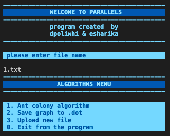
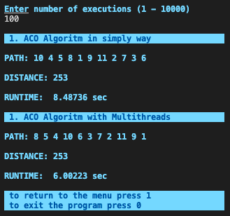
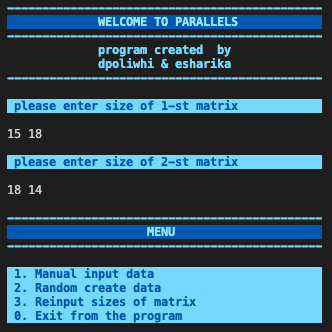
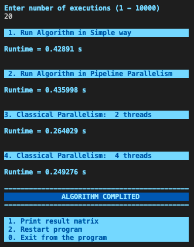
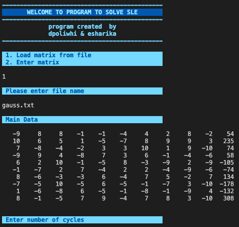
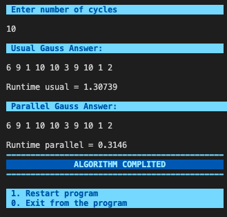

# Parallel programming
### Implementation of several algorithms with parallel programming 
The app allows you to measure the execution time of each algorithm when running in a **single thread** and in **multithreaded mode** 

## Architecture

The general architecture of the program is based on the **MVC** pattern, has a console interface, which is located in the Interface directory.  The main algorithms are located in the Model directory. 
_____
## Algorithms
-  Ant colony optimization algorithm **(ACO)** to solve the traveling salesman problem
- **Winograd algorithm** of matrix multiplication
- Solving systems of linear equations **(SLE)** using the Gaussian elimination method
____
### ACO algorithm

The algorithm will give the result of the route length closest to the minimum value.  A feature of the algorithm - the highest speed and maximum proximity to real life   Object-oriented approach allows you to repeat the life of an ant colony, reproduce the trip for food along the trails, choosing the path according to the pheromones left on the trail.   
Files with graphs are located in the *datasets* directory and are presented as *.txt* files with adjacency matrices.  
The application also allows you to convert *.txt* file to *.dot* file (item 2 of the main menu of the console interface)  
To view the graph, you need to install the appropriate extension for the IDE (for example, Graphviz for VS Code)  

#### Multithreads
Algo implemented in a simple way (without parallelism) and with *Multithreads* in **Pipeline mode**. 
Pipelining is generally based on dividing the algorithm to be executed into smaller parts, called stages, and allocating a separate thread to each of them.

________

### Winograd algorithm

The program allows you to enter the dimensions of matrices 
Then you can choice the mode of input data *(random or manual)* 

All input data is validated 

#### Multithreads
Algo implemented in a simple way (without parallelism), with **Pipeline parallelism** and with **Classic parallelism** . 

Classic parallelism divides the number of execution 
with the number of threads equal to 2, 4, 8, ..., 4 * (number of logical computer processors) 

________

### SLE algorithm

Algorithm allows you to enter SLE matrix manualy or load from file (*datasets directory*) 

All input data is validated 

#### Multithreads
Algo implemented in a simple way (without parallelism) and with **Pipeline parallelism**

********* 

## Makefile
The root directory contains a Makefile with the following targets:

* **make ant** - run *ACO* algorithm 
* **make gauss** - run *SLE* algorithm 
* **make winograd** - run *Winograd* algorithm 
* check / clang - starts checking all files for style norms, leaks, and **cppcheck**
* clean - performs a complete cleanup of installation files

